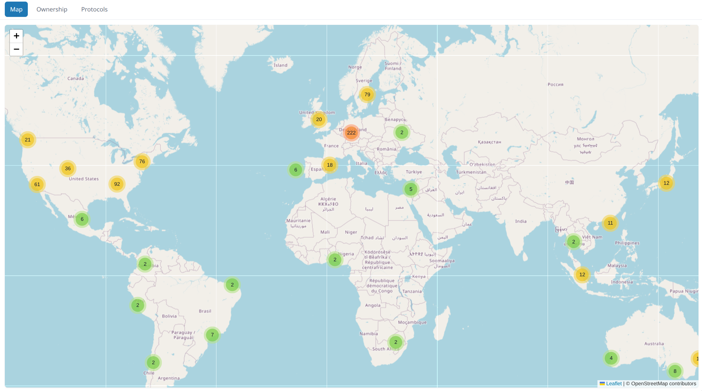

# Mullvad Viz

A small visualization app that plots Mullvad VPN relays on a Leaflet world map and shows simple charts (ownership and protocol distribution).

This repository contains a tiny Express backend that serves static frontend assets and an API endpoint that returns relay data from a JSON file. Tools are provided to fetch relay information from Mullvad's public relay API and to manage city coordinates.

## Prerequisites

- Node 18+ (for built-in fetch support) or a compatible environment.
- No Mullvad CLI is required — the ingestion script fetches relays directly from the public Mullvad relays API.

---

## Quick start

1. Install dependencies
   - npm install

2. Start the server
   - npm start
   - The server listens on http://localhost:3000 by default.

3. Development
   - npm run dev
   - Note: `dev` uses `nodemon` if available. If you don't have it installed, run `node server.js` directly.

4. Open the UI
   - Open http://localhost:3000 in your browser. The UI loads the relay data from `/api/relays`.

---

## What is included

- server.js — Express server. Serves `public/` statically and exposes `/api/relays` which returns the JSON found at `data/relays.json`. It also exposes a small on-demand geocode endpoint (`/api/geocode?city=...`) for ad-hoc lookups.
- public/
  - index.html — main UI (Leaflet + Chart.js).
  - app.js — frontend logic: fetches `/api/relays`, renders markers and charts, provides hash-based navigation.
  - styles.css — simple styles for the UI.
- data/
  - relays.json — canonical relay list consumed by the frontend (cached by the ingestion tool).
  - mullvad_api_raw.json — full raw payload fetched from Mullvad's public API (cached).
  - city-coordinates.json — supplemental map of city codes / names -> lat/lon used by ingestion tooling.
  - countries.json — optional country code → country name map used when resolving names.
- tools/
  - fetch-relays.js — ingestion script that fetches the Mullvad relays API (https://api.mullvad.net/www/relays/all/), normalizes entries into the canonical relay format, resolves coordinates using `data/city-coordinates.json` and `data/countries.json`, and writes `data/relays.json` (and `tools/data/relays.json`) as a cached copy.
  - update-city-coords.js — queries Nominatim (OpenStreetMap) to populate or refresh `data/city-coordinates.json`. The script is rate-limited (3s between requests) and tries a few candidate queries for ambiguous city names.
  - add-city-coordinate.js — helper script to add a predefined Tirana coordinate entry into `data/city-coordinates.json`.
  - data/ — example tool data (note: some older CLI-specific diagnostic tools have been removed).

---

## Ingestion (how it works)

- Run:
  - npm run ingest
  - This runs `tools/fetch-relays.js`, which:
    1. Fetches the public Mullvad relays API at https://api.mullvad.net/www/relays/all/
    2. Writes a full raw cache (data/mullvad_api_raw.json) so you have the full API payload locally.
    3. Maps the API's fields to the project's canonical relay schema:
       - id, country, countryCode, city, lat, lon, ownership, protocols, active
    4. Resolves lat/lon using supplemental lookups:
       - data/city-coordinates.json (tools/data fallback)
       - case-insensitive city name lookup
       - friendly cityCode -> cityName fallback
       - country centroid fallback
       - If none match, lat and lon are set to null and the frontend skips plotting that server.
    5. Writes the sanitized dataset to `tools/data/relays.json` and `data/relays.json` for caching.

- Refresh or improve city coordinates:
  - Populate/refresh city coordinates with:
    - npm run update-city-coords  (this runs tools/update-city-coords.js via an npm script)
    - Or run the tool directly: node tools/update-city-coords.js --all
  - Note: Nominatim (OpenStreetMap) is rate-limited. The updater enforces a 3s delay and tries several candidate queries for each city (e.g., stripping state tokens) to improve matches.
  - After updating coordinates, run npm run ingest to regenerate `data/relays.json` with the improved coords.

---

## Available npm scripts

- npm start — start the Express server
- npm run dev — start with nodemon (if available)
- npm run ingest — fetch relays from the Mullvad public API and cache to `data/relays.json`
- npm run add-city — run the helper that adds a Tirana (tia) coordinate to the city coordinates file
- npm run update-city-coords — run the bulk Nominatim updater (tools/update-city-coords.js)

---

## Data format (relays.json)

Each relay entry is a JSON object with these fields:

- id (string) — host identifier (e.g., `gb-lon-wg-001`)
- country (string) — friendly country name (e.g., `United Kingdom`)
- countryCode (string) — ISO-like code (e.g., `GB`)
- city (string) — display name for city
- lat (number|null) — latitude (decimal degrees) or null when unresolved
- lon (number|null) — longitude (decimal degrees) or null when unresolved
- ownership (string) — `"Mullvad"` or `"Rented"` (defaults to `"Mullvad"`)
- protocols (array of strings) — e.g., `["OpenVPN"]` or `["WireGuard"]`
- active (boolean) — whether the Mullvad API reports the relay as active/online (if available)

Example:
{
  "id": "gb-lon-ovpn-001",
  "country": "United Kingdom",
  "countryCode": "GB",
  "city": "London",
  "lat": 51.51412,
  "lon": -0.09369,
  "ownership": "Mullvad",
  "protocols": ["OpenVPN"],
  "active": true
}

---

## Screenshots

Map view (example):  

---

## Troubleshooting

- If the map shows no markers:
  - Verify `data/relays.json` exists and contains an array of objects.
  - Check the server by visiting http://localhost:3000/api/relays (should return JSON).
- If `npm run ingest` fails:
  - Ensure your environment can perform outbound HTTPS requests (the ingestion script fetches the public Mullvad API).
  - Enable `INGEST_DEBUG=1` to get verbose logs from the ingestion script.
- If city lookup misses (e.g., "San Jose, CA"), run:
  - node tools/update-city-coords.js --city "San Jose, CA"
  - or run the bulk updater with: node tools/update-city-coords.js --all
  - After updating coordinates re-run: npm run ingest

---

## License

This project is licensed under the MIT license. See the `LICENSE` file or the `license` field in `package.json`.
